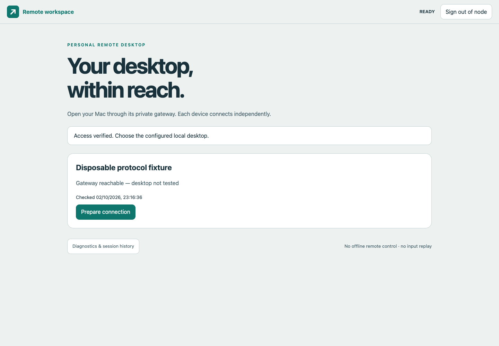
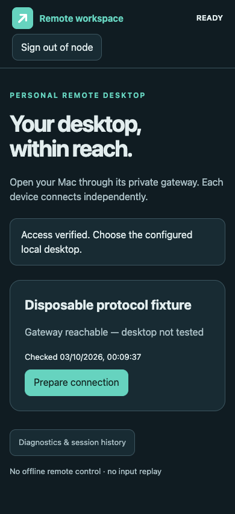
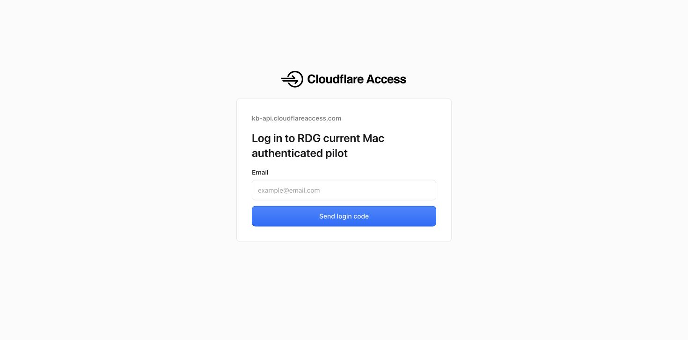

# Local implementation acceptance report

## Current browser delivery fix — 2026-10-03

The owner reported two CSP errors: an injected Cloudflare Insights beacon and an authenticated manifest redirected to Access. The current [deployment receipt](manifest-deployment.json) is runtime authority for source `4deb5fc`, exact image `sha256:3e854a62f4c3d8f5bcc629b66500902fa806a4cf1b207a3e5a739d896977519c` and web build `e74a550dae75ff3d`. Only the manifest link changed in production source; it now includes `crossorigin="use-credentials"`. Java authorization and strict CSP remain unchanged. The additive saved/Active Cloudflare rule matches only `remote.gmb01.xyz` and sets only Disable RUM; the previous ERP rule and global analytics are preserved. No Access scope, Tunnel ingress/DNS or broad transformation setting changed.

84 Node and 94 Java checks PASS. [Eight actual Chromium login/manifest fixture checks](manifest-browser-results.json) PASS: the native manifest manager includes the actual fixture HttpOnly cookie, receives `200` and recognizes the production manifest. A missing-attribute control omits that available cookie, redirects and triggers exactly one CSP violation. Review found and corrected an initially broad console classifier: only the baseline page's known manifest CSP signature is expected, exactly once; other errors still fail. The corrected standard browser harness passed with zero JavaScript/unexpected console errors. The earlier six-case login and eighteen-case UI/protocol receipts remain historical for their stated source/build scopes.

[Ten live HTTP negative checks](manifest-live-checks.json) PASS. Gateway health, deployed manifest attribute/build/JAR, preserved encrypted-state/key volumes, other nine container IDs and connector readiness/four connections were verified separately. Before gateway-only replacement, the owned guacd had zero active desktop connections. Initial startup/volume-order collection assumptions were corrected by read-only checks; no second restart was performed. [Exact-image cached scan](manifest-image-trivy.json) retains 13 Medium/16 Low findings with no fixed-version rows; the advisory snapshot was not refreshed and is not zero-risk certification. The saved edge rule and fixtures do not prove the owner's credentialed public manifest, public HTML beacon absence, Safari or real Mac desktop; those remain explicitly unverified. Login-only Access migration still awaits its existing action-time confirmation.

## Connector recovery — 2026-10-03

The owner reported Cloudflare Error 1033. Read-only preflight found the old dedicated connector PID absent, its loopback readiness port closed, and gateway health still `200`. No persistent dedicated service had been installed. The old process's exit mechanism remains UNKNOWN; this is evidence of a missing process supervisor, not a proven exec timeout or an application-origin failure.

The current personal Tunnel now runs under a separate owner-user LaunchAgent, `com.rdg.current-mac-pilot.cloudflared`, using the same private config/UUID and official installed cloudflared. Its owner-only plist enables RunAtLoad/KeepAlive with ten-second restart throttling, loopback-only metrics, no auto-update and discarded output/error. It does not replace any existing service, Tunnel, ingress/DNS or Access policy. [Recovery receipt](tunnel-supervision-recovery.json) records the exact executable/plist/config digests, launchd PID ownership, readiness `200`, four edge connections and an approved SIGTERM of only the verified dedicated PID followed by automatic replacement. The initial collector failed after recovery while probing a root-owned unrelated process with `kill(pid,0)`; read-only `ps` corrected that preservation probe. No unrelated signal was sent, and exact recovery elapsed time is unknown rather than invented.

Separate subsequent executions confirm the connector survives its launching exec. The ten existing running container IDs, three unrelated cloudflared PIDs and prior configuration/service file digests remain unchanged; gateway image and health are unchanged. [Focused live checks](tunnel-supervision-live-checks.json) pass ten named origin/public negative boundaries. The official Tunnel info query confirms the dedicated UUID, but its CLI connection-count schema was not resolved in that collector; four active edge connections are separately observed through the dedicated loopback metric and independent read-only review. Public anonymous `302` redirects could still occur during the outage because Access intercepts before the origin; they are never sufficient availability evidence. Future connector delivery requires readiness/edge connection and process-recovery checks alongside authorization checks.

This restores bounded connector availability while the owner GUI session, Mac, Docker and network remain active. No logout, sleep/lid, pre-login/FileVault or reboot availability is claimed. The real Mac desktop and login-only Access migration remain unverified/pending as described below. See the [authoritative supervision and rollback procedure](../../deployment/README.md#dedicated-connector-supervision-on-the-approved-mac).

## Current owner-requested deployment: desktop setup and one-year browser trust

The OWNER_SETUP gateway includes the native login-form/provider-return and manifest-credential fixes at the existing personal hostname. [Current deployment receipt](manifest-deployment.json) is the runtime authority; the [prior login-return receipt](login-return-deployment.json) records its earlier exact image, and the earlier [owner-setup receipt](owner-setup-deployment.json) and original BLOCKED pilot sections are historical. Access/Tunnel login-only migration still awaits the existing required browser action-time confirmation. All-path Access remains active, so the gateway's one-year trust cannot yet eliminate its repeat login prompts.

84 Node and 94 Java tests pass. [Six real HTTPS Chromium login fixture checks](login-browser-results.json) pass with zero JavaScript/unexpected console errors and no desktop upgrade. Earlier [18 Chromium checks](browser-results.json) cover separate UI/protocol/update fixture scopes on the prior web build. [Live checks](login-return-live-checks.json) pass 13 origin/negative cases and four public Access interception cases. The prior login-return deployment receipt confirmed image `sha256:cbbfaadd12d4dce9dc8f15d3909d4b343ed91a01f546fc7c1afddba669e5bab3`, healthy non-root/read-only gateway, preserved separate encrypted-state/key volumes, no published guacd port, and unchanged unrelated containers/connectors. [Exact-image scan](login-return-image-trivy.json) retains 13 Medium/16 Low findings with no fixed-version rows in the existing cached advisory snapshot; it is not zero-risk certification.

The authenticated page accepts the owner's existing Screen Sharing VNC password once; it is encrypted server-side and never placed in Git, a URL, browser storage or evidence. No actual credential is retained in the test harness. Control/view, virtual keys and optional clipboard are enabled after provisioning, with UNVERIFIED_TEST_PROFILE rather than fabricated keyboard calibration. Successful real Mac desktop authentication/display and one-year owner enrollment still need the owner's browser test. No broad real hardware acceptance gate is marked passed from fixtures.

See [owner setup and device trust](../../docs/18_OWNER_SETUP_AND_TRUSTED_DEVICES.md) for the authority, state/backup boundaries and recovery. The original handoff manifest intentionally describes the untouched archive: verify:handoff still reports 16 historical mismatches after implementation changes, and was not rewritten to conceal them. The current implementation/output/evidence snapshot uses verify:artifacts instead.


Recorded: 2026-10-03, Asia/Singapore (UTC+08:00). Source revision: `d7fe91be5507654597cc7734292b3d47f3038b35` on `codex/production-gateway`. Evidence is committed separately. Original `main` began at `d0ce352b7ad76e6b427f68488c40346d0601d491`. Five unrelated staged files were preserved during preparation; the original checkout later advanced independently to `96bc1331015ff5c8e3aae6049e35f10ee3c812d1` and was observed clean at handoff. This pilot work stayed in its separate branch/worktree.

**Result: the production auth/status pilot is live at https://remote.gmb01.xyz; desktop and broader release acceptance remain BLOCKED.** The owner selected option A and confirmed the exact-owner OTP Access setup. The saved whole-host Access app uses a 30-minute session and an exact-email Allow plus mandatory One-time PIN policy. A new dedicated Tunnel validates the real application audience and reaches only the pinned production BLOCKED gateway on loopback. Official cloudflared CLI added the previously unused subdomain without DNS overwrite; the apex route, existing Tunnel config, eight existing containers and three existing connector processes were preserved. Public unauthenticated root/API/WebSocket checks passed, and Chrome visibly reached the real OTP login page. Owner OTP completion and gateway acceptance of a genuine owner JWT remain pending. No VNC secret, guacd or test identity signer was deployed. No host permission, firewall, Screen Sharing or reboot change was made. Nothing was pushed. Independent reviews are bounded evidence, not release sign-off.

## Evidence levels

| Layer | Result | Evidence and boundary |
|---|---|---|
| Reference and production JavaScript | PASS: 84 tests | [node-tests.txt](node-tests.txt); original 74 reference tests unchanged, 9 input and 1 atomic-artifact test |
| Implemented Java gateway | PASS: 49 tests, 0 failures/errors/skips | [gateway-tests.json](gateway-tests.json); real local HTTP/javax WebSocket runtime, signed fixture identities and a disposable official-protocol peer |
| Production UI in Chromium | PASS: 12 scenarios | [browser-results.json](browser-results.json); Chromium 153.0.8010.12 / Playwright 1.62.1 on macOS; 0 JavaScript errors, 0 unexpected console errors, 2 expected offline fetch errors |
| Metadata backup/restore | PASS: 3 tests | [backup-tests.txt](backup-tests.txt); disposable SQLite data, node binding, owner-only files, symlink and unsafe-directory rejection |
| Linux ARM64 image | PASS on new exact image | [blocked preparation receipt](cloudflare-pilot-preparation.json), [BLOCKED container](blocked-container-results.json); FULL container startup/denial also rechecked; historical [container-tests.txt](container-tests.txt); non-root, read-only root, noexec tmpfs, dropped capabilities, SQLite initialization, health, missing-JWT HTTP 401 and missing-config startup refusal; no network/ports or real VNC connection |
| Actual official-source guacd failure path | PASS: 4 checks | [official-guacd-tests.txt](official-guacd-tests.txt); native VNC argument contract, control/view requests close after unreachable-target failure and non-root/VNC-only Ubuntu 24.04 inventory; no real VNC desktop or Mac |
| Native password policy | PASS:5 synthetic cases and2 source integrity checks | [security selection](vnc-security-results.json), [source integrity](native-policy-tests.txt); corrected exact image; no password challenge or real authentication |
| Test-only native diagnostics | PASS:279 native +6 Node and isolated daemon integration | [privacy/ABI results](native-diagnostics-tests.json), [network-none official-daemon flow](native-diagnostics-integration.json); fixed labels only, explicit failed-capture refusal; no real target in these checks |
| Dependency/build identity | PASS | [artifacts.json](artifacts.json), runtime lock and vendor provenance; 210 source/output/evidence digests recorded; 11 runtime JARs, SQLite natives, official browser artifact and 393 Ubuntu package records in six locks verified |
| OS package digest refusal | PASS: 1 negative check | [os-package-lock-tests.txt](os-package-lock-tests.txt); mutated package digest refuses installation before changing the original libssl3 |
| Local ARM64 OS/JAR scan | COMPLETED; remaining findings retained | [image-scan.json](image-scan.json); gateway 13 Medium/16 Low, guacd 12 Medium/6 Low; no Ubuntu-priority High/Critical or fixed-version rows; some Medium priorities have High CVSS scores |
| Historical handoff manifest | Historical FAIL | At the original revision, `npm run verify` returned `Missing/unreadable: .gitignore`; later unrelated staged archive repairs were not reviewed in this scope |
| Real Mac/official guacd VNC interoperability | First and corrected attempts FAIL | [Localhost test report](LOCALHOST_TEST_REPORT.md): current-Mac identity/route preflight PASS; ARD selection reproduced and corrected; corrected real view remains TARGET_UNAVAILABLE with a generic native failure label, cause UNKNOWN; no display/control acceptance |
| Windows/macOS controller and Safari/iOS PWA acceptance | BLOCKED | Actual required controller/target combinations, physical layouts and installation/recovery tests unavailable |
| Cloudflare Access/Tunnel status-only pilot | LIVE; owner login pending | [deployment](cloudflare-pilot-deployment.json), [origin checks](cloudflare-origin-negative-checks.json), [public checks](cloudflare-public-negative-checks.json): exact-host protected route, 4 connector connections, healthy pinned gateway; origin health200, absent/forged API and absent WS401, invalid Host/Origin403; public root/API/WS302 to Access with verified TLS; no owner OTP or real desktop tested |
| Actual lock/sleep/lid/FileVault/restart/rollback | BLOCKED | Owner-assisted target recovery path and explicit scope unavailable |

All 64 scenarios in [acceptance-matrix.csv](../acceptance-matrix.csv) are real-system release gates and remain BLOCKED. Their notes identify missing prerequisites and narrower local coverage. This does not indicate 64 local test failures. Synthetic keyboard events and a protocol peer cannot prove a real Mac desktop, physical shortcut capture, native IME, clipboard paste or measured input latency.

## Verified local behavior

The gateway rejects missing/forged identity, wrong issuer/audience/algorithm/email/type, expired/future claims, token-controlled key URLs and invalid JWKS. It uses server-owned target configuration, owner-bound cookies, CSRF, exact Origin/Host and atomic one-use intents. Tests cover controller/intent races, replay, target injection, view-only raw input, maintenance conflicts, failed-cleanup refusal and metadata privacy. Live fixture streams close at idle/absolute expiry and logout on both browser and upstream sides. These checks prove local application policy; real Cloudflare issuance/rotation/revocation and actual guacd teardown timing still require pilot measurement.

The UI uses official Guacamole browser objects, focused input ownership, native Control, observed Left Alt opt-in, AltGr protection, calibrated modifier configuration, virtual controls, explicit bounded clipboard and truthful readiness. Blur/profile/composition/disconnect clear ownership without replay. Direct local IME is disabled with an explicit text/clipboard fallback; its actual Mac compatibility remains unverified.

Chromium checks cover a clean first worker installation, portrait/landscape workspace fitting, focus-loss pause, a second tab preserving the active session, server-authoritative update deferral, accepting-tab-only explicit reload, disconnect cleanup, five launcher widths, dark theme, reduced motion, 200% text sizing, static-only Cache Storage and generic offline navigation. Real browser zoom, device safe areas, suspended tabs and installed PWA behavior on required platforms remain open.

Only harmless protocol fixtures appear in these screenshots:





## Exact artifacts and versions

- Gateway JAR SHA256: `a3437db315b1decbdae76d60c9716c3844920c7291bbd05270f3764749dd8f31`.
- Web build: `cc385c894f584ae2`. Per-file output/source hashes are in `artifacts.json`.
- Local image/index ID: `sha256:c6adb1af9c2d1c1eee58ff30292b1dd66d649d552f8c040d103542cff438450a`; Linux ARM64. Local tag is a convenience only; it was not published.
- Gateway image manifest: `sha256:30bee6ada3bf5ef71bf826c8d73247b177df67d24c0494bb5bf39c4f5dbc7548`.
- Official-source guacd local image/index ID: `sha256:3cbaad3b2d040ddfe1905a99b94c5b61448f2f7358e24bb1e4a2838f38daf06f`; manifest `sha256:f76af7eeb34b5af5ec1936711342588ed3ceea5b1918b4a35ea7f394cc417615`, Ubuntu 24.04 ARM64, VNC-only, explicit recorded local authentication policy, unpublished. The earlier unmodified-source image is retained separately in the ledger.
- Guacamole Java/JS/guacd 1.6.0; Tomcat 9.0.122; build JDK 17.0.17; container Temurin 17.0.20.1+1; Maven 3.9.16; Node 23.10.0 / npm 10.9.2; Docker daemon 28.3.0.
- Current localhost test computer: macOS 26.6.2 (25G83), Darwin ARM64. The owner approved bounded testing on 2026-10-03; the owner later explicitly requested a Cloudflare Tunnel test deployment; existing unrelated routes/services and host permissions remain preserved.

Production JAR inspection found no test/fixture/debug classes. The production image contains the production JAR/assets and the pinned SQLite native library; fixture edge/protocol code stays on the test classpath. The FULL Compose blueprint parses with fictional operator settings and has not been deployed. The separate BLOCKED pilot template was deployed using private real operator configuration outside Git.

Official Guacamole Java and JavaScript artifacts were signature-checked against the [Apache release signing keys](https://downloads.apache.org/guacamole/KEYS), fingerprint recorded in [vendor provenance](../../web/vendor/provenance.json); no independent Web-of-Trust certification is claimed. Runtime coordinates and SHA256 values are in [dependencies.lock.json](../../gateway/dependencies.lock.json). The public-coordinate OSV query returned no advisories for those 11 dependencies; [dependency-advisories.json](dependency-advisories.json) is not a container OS vulnerability scan or proof of absence of vulnerabilities. The image OS scan and remaining vendor issues are recorded below; recheck before a public pilot.

## Reproduce and inspect

Run from this isolated checkout with Java 17 and Node 22 or newer:

```sh
npm ci --ignore-scripts
npm test
npm run build
npm run test:backup
npm run verify:dependencies
npm run test:browser
docker build --platform linux/arm64 -t rdg-gateway:local-verified .
docker build --platform linux/arm64 -f deployment/Guacd.Dockerfile -t rdg-guacd:local-verified .
npm run test:os-lock
npm run test:container
npm run test:official-guacd
npm run test:vnc-security
npm run verify:artifacts
```

The browser check requires an existing Playwright library and Chromium executable. The verified invocation set `RDG_PLAYWRIGHT_MODULE` to the bundled Playwright module and `RDG_TEST_CHROMIUM` to Chromium 153.0.8010.12. No frontend runtime npm dependency, CDN script, tracker or production authentication bypass was added. `verify:artifacts` compares this recorded source/output snapshot; a later reviewed source/build change needs a new evidence ledger. A rebuilt image may have a different attestation/index identity; inspect it separately rather than assuming the recorded tag is immutable.

`qa/test-container.sh` creates and removes only its random fixture volumes/container. The browser launcher similarly removes its loopback processes and temporary key/certificate/assertion. Manual debugging fixtures, old browser session and debug classes were removed. Useful ignored build outputs and local Maven cache remain.

## Failures resolved and remaining risks

The read-only ARM64 image initially refused startup because SQLite JDBC tried loading a native library from noexec tmpfs. The fixed image selects a digest-checked native library from immutable `/app/lib`, preserving non-root/read-only/noexec restrictions. Container regression passed. [ADR-009](../../docs/17_IMPLEMENTATION_AND_OPERATIONS.md) records the decision; AMD64 execution remains unverified.

An additional official-daemon regression exposed two transport cleanup gaps. The browser is now registered with the session before upstream negotiation, and upstream `error`/`disconnect` instructions cause server-owned teardown even when the browser ignores them. Three added Java regressions and the real guacd failure-path check passed; the check was repeated successfully against the supported-OS official-source build. No Mac compatibility is inferred.

The approved current-Mac view attempt failed before display. The original native daemon selected ARD30 in a synthetic reproduction of this Mac's advertised offer list, although the gateway stores a separate VNC password. The explicit integration policy now uses official LibVNCClient APIs to select VNC2 and reject other completed schemes. Five synthetic cases and four final-daemon checks pass; corrected-image real retries still fail at VIEW_CONNECTION/TARGET_UNAVAILABLE. The final diagnostic capture completed with NATIVE_CONNECTION_FAILURE_UNCLASSIFIED only; no authentication cause or real desktop success is inferred. A bounded independent static review found no remaining actionable issue in the native policy, provenance or six pilot/probe files. Its only new evidence-accuracy finding was corrected: the legacy case must actually send ServerInit and observe closure before PASS. This static review is not real-device or release sign-off. [ADR-011](../../docs/17_IMPLEMENTATION_AND_OPERATIONS.md) and [the localhost report](LOCALHOST_TEST_REPORT.md) record the limits.

The optional diagnostic collector is test-only and leaves the production image/JAR/frontend unchanged. It passed279 classifier/file-safety cases on the pinned compiler and production-image ABI, six Node privacy/provenance/process-status checks, and actual official-daemon network-none failure integration. Bounded independent source review confirmed the explicit Docker capture-status fix; no remaining actionable finding in that scope is real-device/release sign-off. Earlier incomplete attach harvesting and a root cleanup interruption are retained and accurately described in the localhost report and ADR-012.

Other local regressions fixed during implementation include the official sample endpoint's close/send race, Guacamole's empty `?` WebSocket query interoperability, same-cookie second-tab bootstrap revocation, first-worker prompt timing, modifier alias refcounts/composition release, and wrapped mobile headers overflowing the workspace. Final relevant checks passed; none establish real-target compatibility.

The OS audit additionally found six OpenSSL package findings in the pinned JRE base, including CVE-2026-84782. The digest-locked Ubuntu libssl3 3.0.2-0ubuntu1.30 patch resolved all six. The published guacd image uses unsupported Alpine 3.18.12; a signature-verified Apache 1.6.0 source build with the recorded explicit local password-authentication modification now supplies only VNC on pinned Ubuntu 24.04. The final daemon passed its native argument/failure cleanup and non-root/VNC-only inventory checks. [ADR-010](../../docs/17_IMPLEMENTATION_AND_OPERATIONS.md) records the packaging decision.

[Trivy source/attestation receipt](scanner-provenance.json), [gateway raw scan](gateway-image-trivy.json), [current guacd raw scan](guacd-password-policy-trivy.json), [earlier unmodified-source scan](guacd-image-trivy.json) and [summary](image-scan.json) retain exact image IDs, database dates and every finding. Scans used only local image access in a minimal environment; nothing was uploaded. The authentication-policy image used the same cached advisory snapshot, with no database refresh. Final Ubuntu-priority High/Critical and fixed-version counts are zero, with 29 gateway and 18 guacd Medium/Low package-CVE instances still present. Ubuntu lists some unresolved/deferred fixes, and some Medium priorities have High CVSS scores. This is a limited package inventory/advisory check, not exploitability certification or a public-release pass. No findings were suppressed. Docker Scout required account login and produced no report; the local Trivy fallback completed.

P0 remaining: real-Mac runtime validation and protected credential custody; successful official guacd-to-Screen-Sharing authentication; six modifier calibrations; LAN/IPv6 isolation; genuine owner JWT acceptance and real Access rotation/revocation; actual supported-browser/controller paths; and resolution/assessment of remaining vendor advisories before a full desktop public pilot. P1 remaining: Chinese/dead-key/emoji path, retina pointer/clipboard behavior, actual PWA installation/update/recovery, second-node independence, external-network harmless editor tasks, measured performance and owner-approved rollback/recovery. No FPS/latency claim is made.

## Next authorized boundary

The owner approved bounded localhost testing on the current Mac on 2026-10-03. Read-only preflight confirmed an existing local RFB listener with classic VNC authentication. Provision VNC secrets locally outside Git and chat; the first view-only attempt used an ephemeral signed test identity and has separate failure evidence. Its independently reproduced authentication-selection mismatch is corrected in the exact recorded image. Corrected-image real view retries still FAIL; the final fixed-label capture completed but only reports an unclassified native failure. The cause remains UNKNOWN and no saved credential remains. Resolve this actual interoperability prerequisite with the owner before another authentication attempt. No real Cloudflare issuance is claimed. Start with read-only host preflight and a reviewed node-specific config; perform only explicitly approved project deployment and settings changes. The owner confirmed A at the Access-save/deployment boundary. The separate remote subdomain is now published under the saved exact-owner OTP policy; no existing root route was replaced. Owner login remains a human test at the live OTP page. Host firewall/Screen Sharing permission changes and reboot remain outside current authorization. Then execute every required real-system row or obtain an explicit owner-approved scope reduction before release.

See [deployment runbook](../../deployment/README.md), [implementation and recovery decisions](../../docs/17_IMPLEMENTATION_AND_OPERATIONS.md), and [backlog record](../../PROGRESS.md).

## Owner-requested browser link

The real-Mac manual entry has a tested bounded15-minute mode (eight targeted local-view policy/deadline checks PASS). Its local credential dialog closed without a saved credential, so no real-Mac manual server was started. A separate explicitly labelled Disposable protocol fixture UI was served at localhost32122 for the owner's browser test, with automatic15-minute cleanup. Page/health/signed bootstrap were verified. The fixture emits size/sync only and no real desktop pixels, so its CONNECTED state and empty canvas are not actual-Mac acceptance. Occupied-port startup refusal was verified after adding owned process and listen-marker readiness checks. No saved real credential is retained. See [manual browser record](manual-browser-ui.json); human acceptance is pending and this server is intentionally temporary.

## Authenticated status pilot implementation and historical preparation

The production BLOCKED policy is independently enforced before intent/lease allocation, upstream sockets or credential reads. Default FULL behavior retains strict credential/calibration validation. New tests verify authenticated BLOCKED status, API/WebSocket/CSRF/Origin/owner denial, refusal of both view/control and enabled clipboard, and zero upstream connector calls. The additional browser scenario is an explicitly labelled LOCAL_UI_ROUTE_FIXTURE: it proves disabled UI and zero attempted connections, not genuine Cloudflare issuance. Production JAR inspection found zero test/fixture classes.

The new exact ARM64 gateway image passed FULL startup and an additional BLOCKED startup without a VNC secret or calibration, all on network-none containers with no host ports. The separate [raw scan](blocked-pilot-image-trivy.json) matches this exact image: 13 Medium/16 Low, no fixed-version rows, database updated 2026-10-02T12:48Z. No finding was suppressed and no zero-vulnerability claim is made. The prior image scan remains historical evidence for its recorded image. Independent review identified ambient Docker-context and moving-tag risks in the new QA helper; both were fixed. A targeted exact-image rerun passed with deliberately hostile inherited context/TLS values, and moving-tag/malformed-digest preflight checks refused before creating a fixture. The helper pins the local socket and immutable image with `--pull never`.

The prior preparation receipt is historical. Existing Wrangler OAuth lacked Access/DNS scopes. Automatic approval review rejected extraction of an API token from the cloudflared certificate for API probing; that action was not executed or retried. The approved safer mechanism used the logged-in Cloudflare dashboard to save the new exact-owner OTP policy/app after the owner selected A. Official cloudflared CLI used its supported credential mechanism to add only the unused remote subdomain. No token was extracted and no credential was committed. The prior 404-only route was replaced only within the new dedicated Tunnel by exact-host loopback HTTP plus mandatory Access audience validation and a404 fallback. Genuine owner OTP/JWT acceptance and external-device desktop tests remain pending.

[Historical preparation cleanup](blocked-pilot-cleanup.json) recorded the eight original containers, three original cloudflared processes, no owned temporary fixture directories/container and no localhost32122 listener. [Live deployment receipt](cloudflare-pilot-deployment.json) independently rechecked all original services while the separate BLOCKED gateway and connector remain running for the owner test. The prior manual protocol fixture expired; it never supplied Mac pixels. Its earlier blank/CONNECTED state is not desktop acceptance. All64 real release gates remain BLOCKED.

## Historical BLOCKED Cloudflare pilot handoff

Open [remote.gmb01.xyz](https://remote.gmb01.xyz) and complete the existing owner's One-time PIN sign-in in the page; do not send the code in chat. The public login screen was observed in Chrome after the DNS change. The Access app audience was taken from the saved app UI and supplied privately to both the connector and Java verifier. Public JWKS retrieval returned200 with two keys under normal TLS verification. The [independent public negative checks](cloudflare-public-negative-checks.json) made three exact HTTPS requests without cookies/authentication and did not follow redirects: root, devices API and a dummy WebSocket Upgrade each returned302 to the actual Access login route, without a101 or detected gateway/private response. These checks establish the unauthenticated boundary only.



The pilot container is healthy, non-root, read-only and bound to127.0.0.1:32120. Desktop remains BLOCKED by production policy. The gateway does not start guacd, mount VNC credentials, fabricate calibration or reuse the expired browser fixture. The exact image was previously tested and scanned as recorded above; no rebuild or moving-tag substitution occurred. [Independent read-only runtime/config review](cloudflare-pilot-review.json) found no actionable issue in that scope. It did not verify owner OTP, real desktop or unrelated service history. This current-Mac pilot depends on the running Mac, Docker and connector; sleep/reboot/startup continuity has not been verified or installed. Keep the saved Access protection until this pilot route is removed during any later rollback. All64 broader real-device release gates remain BLOCKED.

## Mobile login return regression — 2026-10-03

The owner supplied a mobile screenshot of `login.json` containing `ORIGIN_DENIED`. Its exact request path, method and header values were not captured; the specific production trigger remains unknown. Real loopback Tomcat tests reproduced two independent navigation failures in the deployed source: signed `GET /login` with an opaque/foreign Origin and login/landing GETs with query parameters. The prior fixtures exercised direct same-origin login, so they missed provider-return navigation.

The fix separates navigation from enrollment. Login GET keeps exact Host and signed owner Access verification, discards queries through a fixed relative redirect, and renders fixed HTML for navigation errors. Enrollment POST retains exact Origin, no query and one-use nonce checks before any existing-trust shortcut. API/WebSocket guards are unchanged. A regression also strengthens the prior already-trusted POST path, which could shortcut with a missing Origin. Source tests and a disposable signed browser return flow provide bounded evidence; they do not prove the owner's real Safari/Access return, Mac desktop or one-year production migration.

Prevention: any future login or trusted-browser change must exercise cross-origin provider return, inert query canonicalization, and absent/opaque/foreign POST Origins alongside direct login. Do not diagnose a screenshot by assuming its unobserved headers, record authentication return query values, or loosen protected API guards to make navigation pass.

The real Chromium form regression found a second, directly reproduced cause: global `Referrer-Policy: no-referrer` made the page's own native POST serialize `Origin: null` and return `403`. Prior Java HTTP tests supplied an explicit Origin and did not exercise browser-generated form headers. Login GET HTML now overrides the policy to `same-origin`; enrollment retains exact-Origin validation. Natural Chromium provider-return GETs were `ABSENT`, not `NULL`, so an initial harness assumption requiring NULL was corrected; opaque GET coverage is separately labelled synthetic. The actual phone request's method/headers remain unobserved.

Final login-fix validation: 94 Java tests, six native Chromium HTTPS login scenarios, 13 live origin checks and four public Access checks PASS. Same-page enrollment now generates SAME_ORIGIN POST303; foreign/native-null POSTs remain403. No production identity signer was deployed. The old opaque sandbox test emitted a fixture-only SecurityError before its POST; its exact cause remains unknown and is recorded in [prior attempts](login-browser-prior-attempts.json). The replacement native no-referrer form generates real Origin:null and preserves the strict zero-error gate. The owner's actual phone return, real Mac desktop and final one-year Access migration remain unverified.
